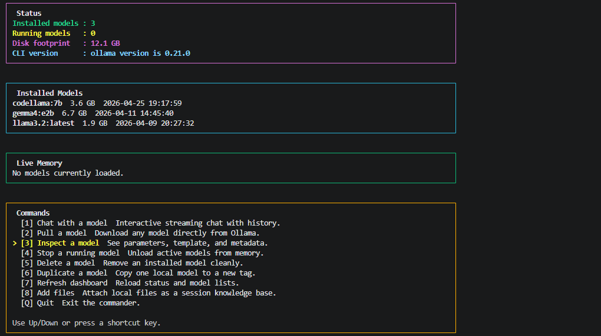
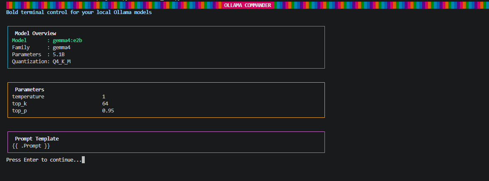
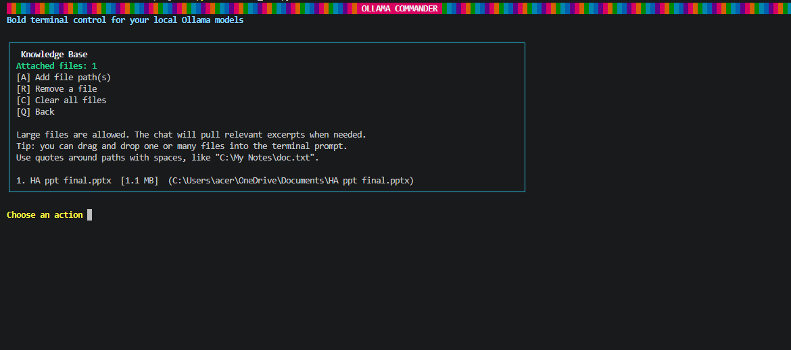

# Ollama Commander

Ollama Commander is a colorful terminal UI for chatting with and managing local Ollama models from one place. It gives you a dashboard for installed models, quick model actions, and a chat mode with an attachable local knowledge base.



## Why It Exists

Ollama is great at serving local models, but day-to-day usage often means juggling commands for listing models, pulling new ones, inspecting metadata, stopping jobs, and jumping into chat. Ollama Commander puts those workflows into a single keyboard-friendly terminal interface.

## Features

- ANSI-powered dashboard with model status, disk footprint, and live memory panels
- Arrow-key navigation with a focused command menu
- Interactive chat mode with conversation history
- Split conversation layout for user prompts and model replies
- Local knowledge-base attachments for chat context
- Persistent knowledge-base file list across restarts
- Large-file support through prompt-aware excerpt selection
- Format-aware extraction for `.pptx` and `.docx`
- Model actions for pull, inspect, stop, delete, duplicate, and refresh
- No external Python dependencies

## Screenshots

### Main Dashboard

Installed models, live memory, and the command launcher in one view.


### Model Inspection

Inspect a model's family, parameters, quantization, and prompt template without leaving the terminal.



### Knowledge Base

Attach local files, keep them across restarts, and manage your session context from the built-in knowledge-base panel.



## Requirements

- Python 3.10 or newer
- [Ollama](https://ollama.com/) installed and running locally
- A terminal with ANSI color support

## Quick Start

```powershell
git clone https://github.com/Gugan-web/ollama-commander.git
cd ollama-commander
python .\ollama_cli.py
```

You can also launch it with:

```powershell
.\run-commander.bat
```

## Controls

- `Up` and `Down`: move through menus
- `Enter`: select the highlighted action
- `Q`: back out or quit
- `/clear`: reset chat history
- `/files`: open the knowledge-base file manager from chat
- `/exit`: leave chat mode

## Knowledge Base

The chat mode can attach local files and use them as supporting context for your prompt.

- Attach files from the `Add files` menu or with `/files` inside chat
- Attached files are remembered across restarts in `.ollama_commander_kb.json`
- Large files are not shoved directly into the prompt
- The app selects relevant excerpts from attached files based on the latest user message
- `.pptx` and `.docx` files are extracted in a format-aware way
- Text and code files are read directly with UTF-8 fallback handling

This keeps prompts smaller and makes large local files practical to use with local models.

## Environment

By default the app talks to:

```text
http://127.0.0.1:11434
```

If your Ollama server runs somewhere else, set `OLLAMA_HOST` before launching:

```powershell
$env:OLLAMA_HOST = "http://192.168.1.10:11434"
python .\ollama_cli.py
```

## Project Layout

```text
.
├── ollama_cli.py
├── run-commander.bat
├── assets/
│   └── screenshots/
│       ├── dashboard-main.png
│       ├── inspect-model.png
│       └── knowledge-base.png
└── README.md
```

## Notes

- This project is focused on local, terminal-based Ollama workflows
- Knowledge-base support is best for text-heavy files and extracted Office content
- Extremely large or binary-heavy files still depend on how much useful text can be extracted

## Roadmap Ideas

- PDF support
- Richer chat transcript rendering
- Better retrieval across multiple large files
- Exportable chat sessions
