# Ollama Commander

Ollama Commander is a colorful terminal UI for chatting with and managing local Ollama models from one place. It gives you a dashboard for installed models, quick model actions, and a chat mode with an attachable local knowledge base.

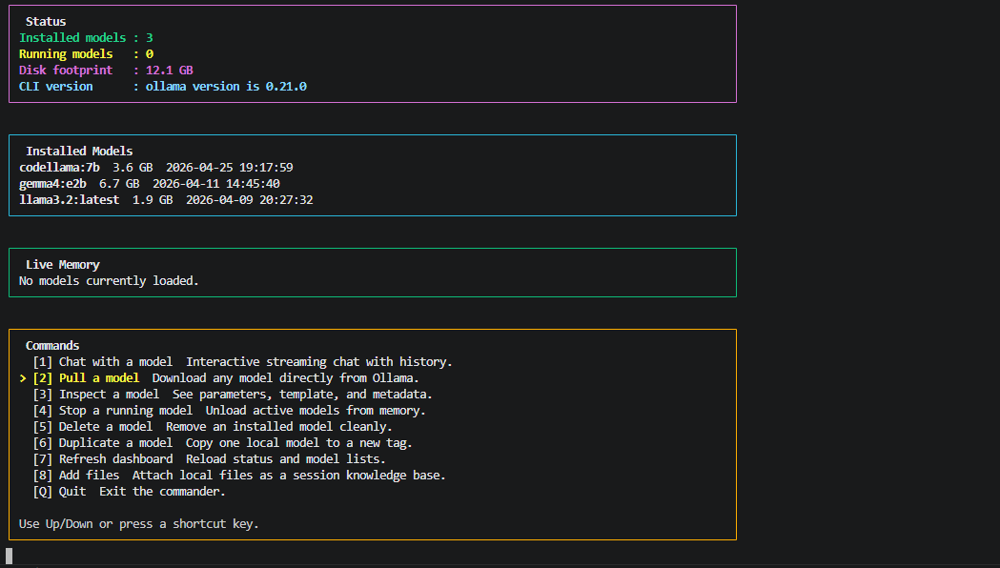

## Why It Exists

Ollama is great at serving local models, but day-to-day usage often means juggling commands for listing models, pulling new ones, inspecting metadata, stopping jobs, and jumping into chat. Ollama Commander puts those workflows into a single keyboard-friendly terminal interface.

## Features

- ANSI-powered dashboard with model status, disk footprint, and live memory panels
- Arrow-key navigation with a focused command menu
- Interactive chat mode with conversation history
- Split conversation layout for user prompts and model replies
- Local knowledge-base attachments for chat context
- Persistent knowledge-base file list across restarts
- Large-file support through prompt-aware excerpt selection
- Format-aware extraction for `.pptx` and `.docx`
- Model actions for pull, inspect, stop, delete, duplicate, and refresh
- No external Python dependencies

## Requirements

- Python 3.10 or newer
- [Ollama](https://ollama.com/) installed and running locally
- A terminal with ANSI color support

## Quick Start

```powershell
git clone https://github.com/Gugan-web/ollama-commander.git
cd ollama-commander
python .\ollama_cli.py
```

You can also launch it with:

```powershell
.\run-commander.bat
```

## Controls

- `Up` and `Down`: move through menus
- `Enter`: select the highlighted action
- `Q`: back out or quit
- `/clear`: reset chat history
- `/files`: open the knowledge-base file manager from chat
- `/exit`: leave chat mode

## Screenshot Walkthrough

### Dashboard And Model Actions

The main dashboard keeps the current state visible while letting you jump straight into model actions.


Pull mode opens a clean prompt for typing the model tag you want to download.

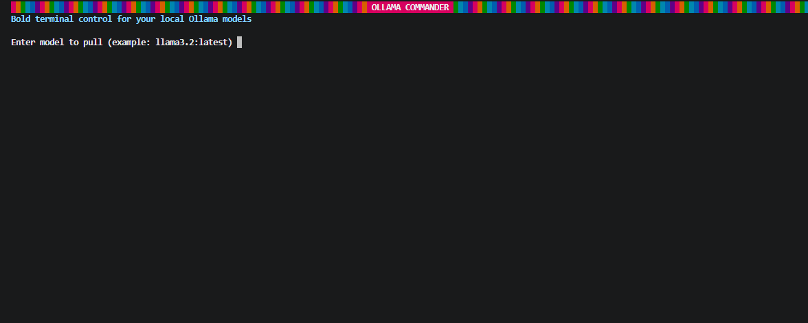

Inspect mode starts from the dashboard and keeps the workflow keyboard-first.


Installed models are selected through a simple list picker.

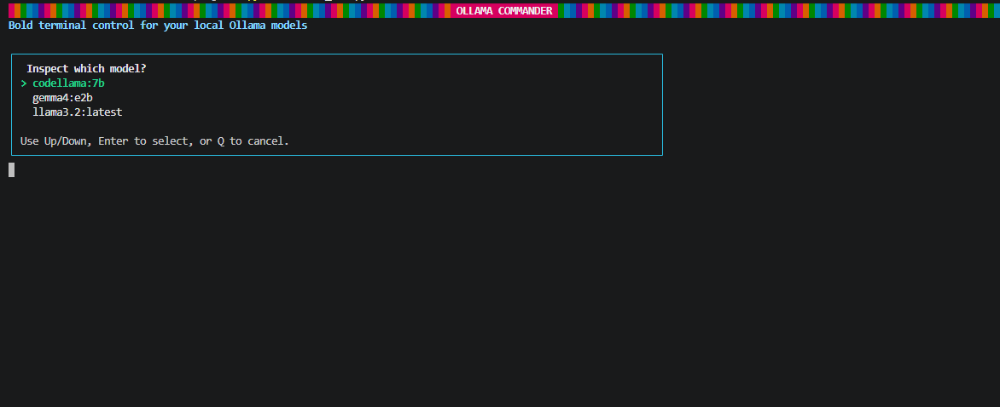

Once selected, the model overview shows family, parameter size, quantization, parameters, and prompt template.


Stop mode is available directly from the dashboard when you want to unload running models.

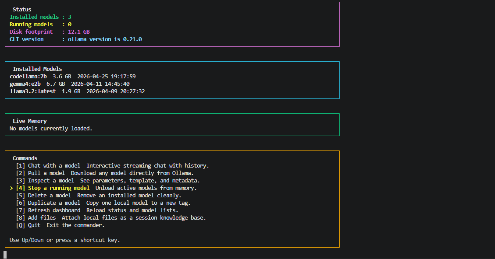

When nothing is running, the app shows a friendly empty state instead of failing.

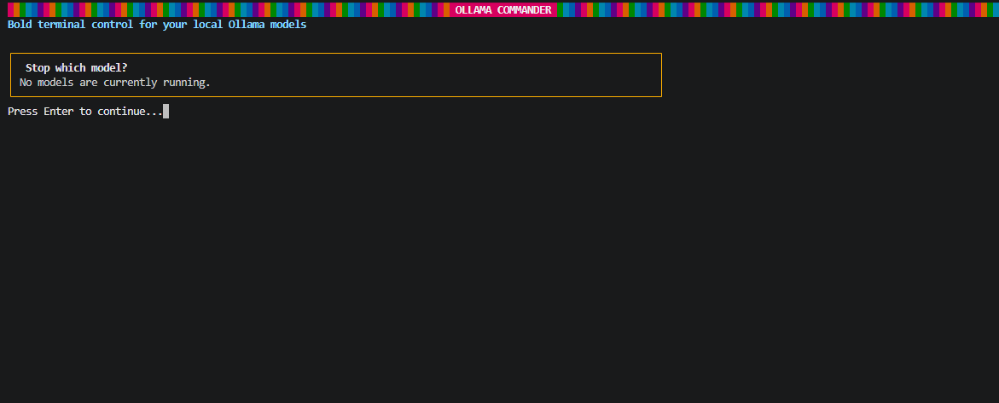

Delete mode uses the same consistent model picker.

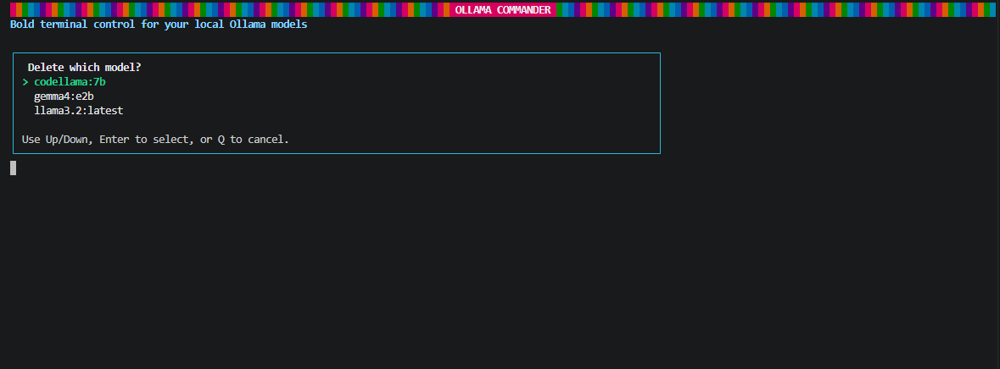

Duplicate mode is exposed from the dashboard too, so cloning an installed model into a new tag stays quick.

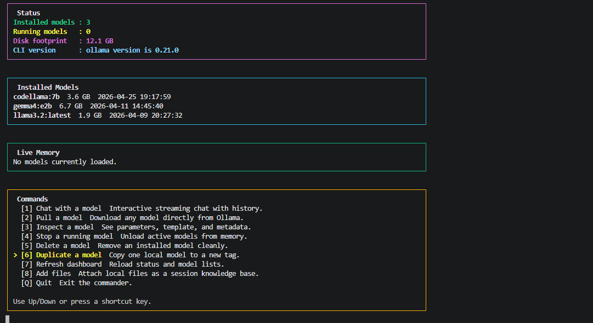

The duplicate picker matches the rest of the terminal UI.

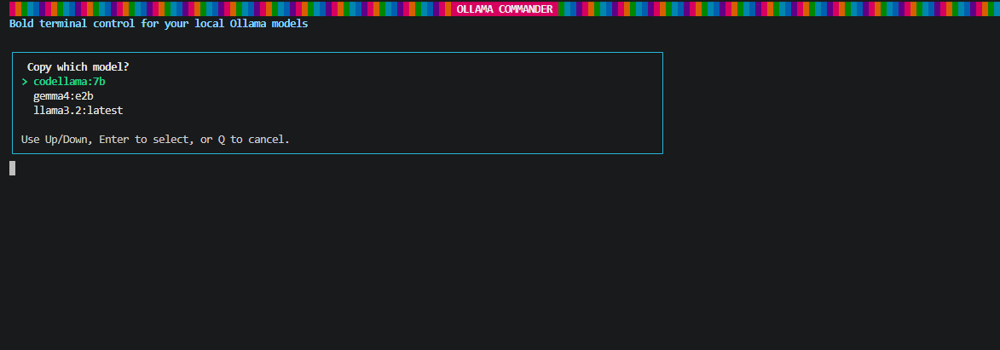

Refresh is available as a first-class dashboard action when you just want to reload model state.

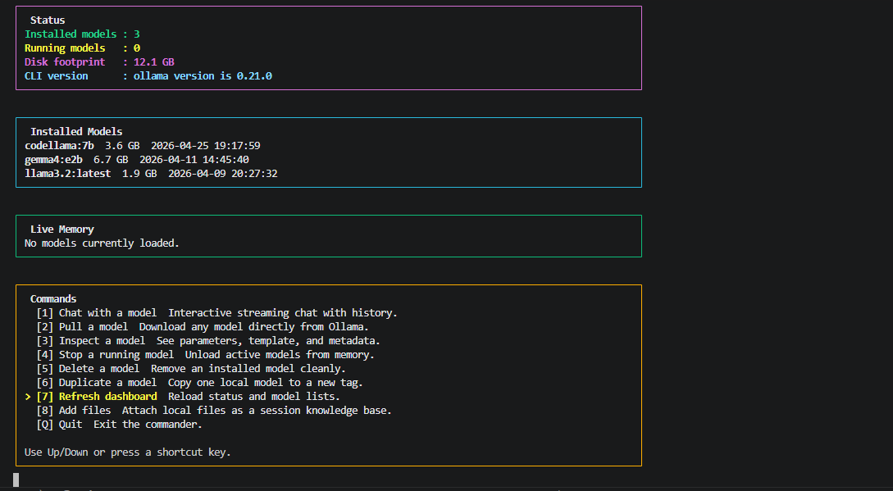

The knowledge-base workflow also starts from the dashboard.

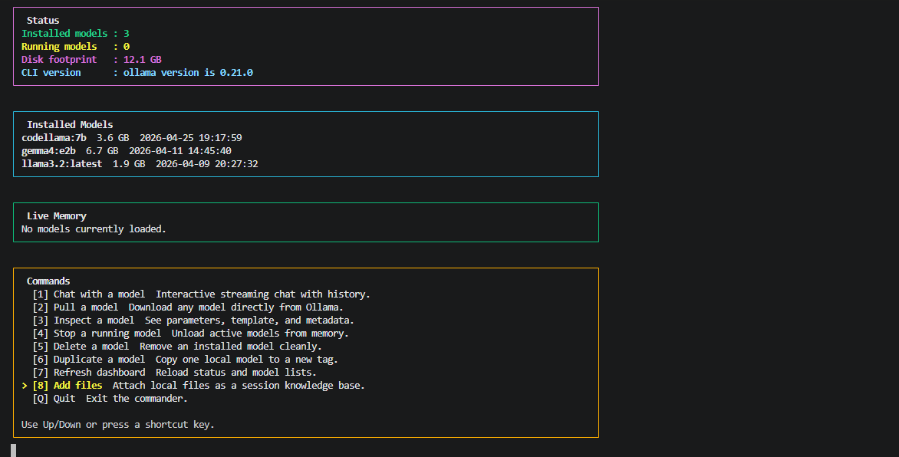

### Knowledge Base Walkthrough

The knowledge-base home screen shows the current attachments, available actions, and drag-and-drop help text.


Drag-and-drop works from Explorer into the terminal prompt.

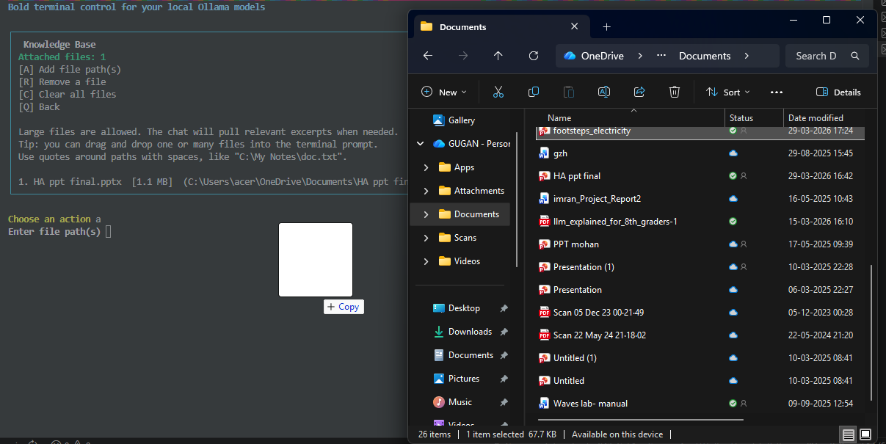

You can also paste the file path manually.

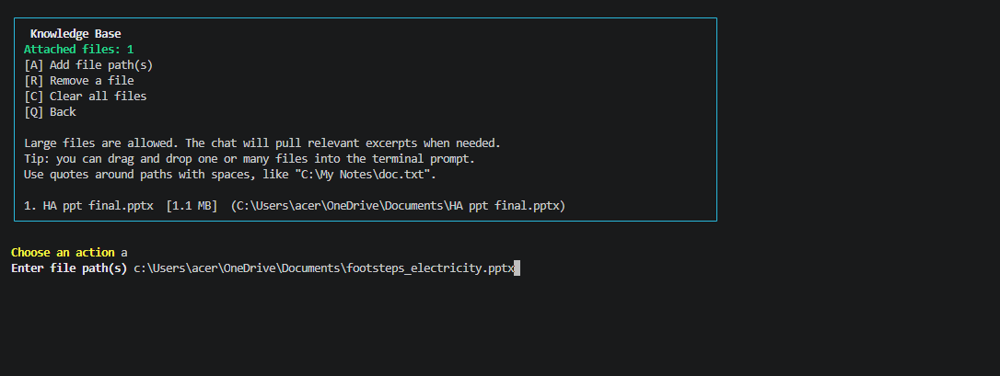

After adding a file, the panel confirms success and updates the attachment list immediately.

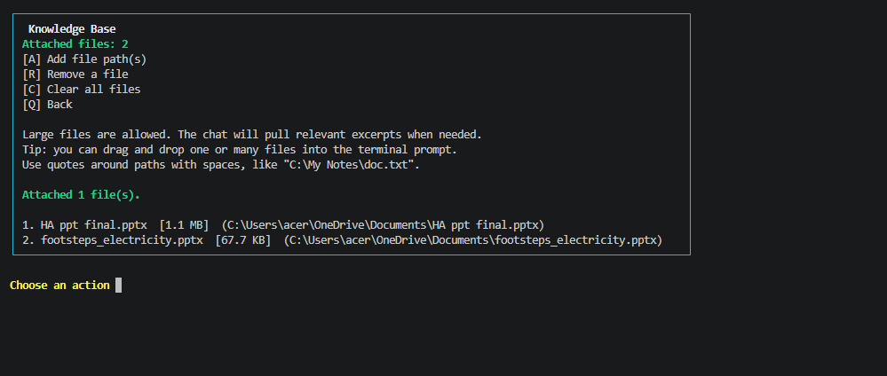

Removing a file uses a numbered prompt.

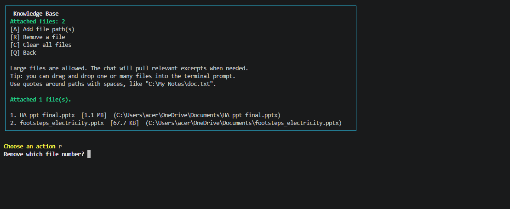

The list updates right after removal.

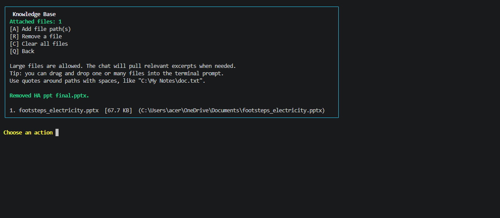

Status messages remain visible so it is clear what changed.

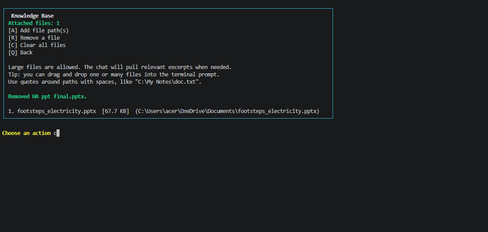

Clearing the knowledge base returns the panel to its empty state.

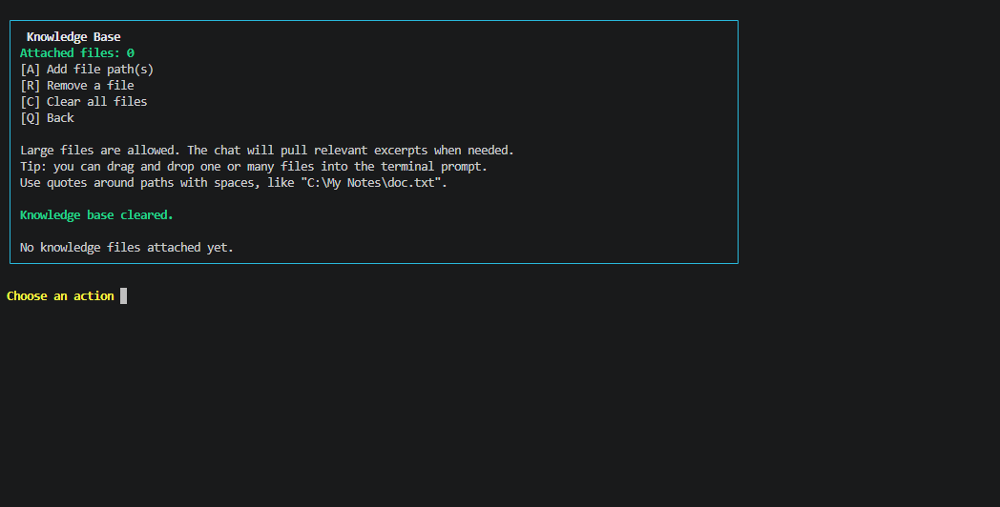

## Knowledge Base

The chat mode can attach local files and use them as supporting context for your prompt.

- Attach files from the `Add files` menu or with `/files` inside chat
- Attached files are remembered across restarts in `.ollama_commander_kb.json`
- Large files are not shoved directly into the prompt
- The app selects relevant excerpts from attached files based on the latest user message
- `.pptx` and `.docx` files are extracted in a format-aware way
- Text and code files are read directly with UTF-8 fallback handling

This keeps prompts smaller and makes large local files practical to use with local models.

## Environment

By default the app talks to:

```text
http://127.0.0.1:11434
```

If your Ollama server runs somewhere else, set `OLLAMA_HOST` before launching:

```powershell
$env:OLLAMA_HOST = "http://192.168.1.10:11434"
python .\ollama_cli.py
```

## Project Layout

```text
.
|-- ollama_cli.py
|-- run-commander.bat
|-- assets/
|   `-- screenshots/
|       |-- 01-dashboard-pull.png
|       |-- 02-pull-prompt.png
|       |-- 03-dashboard-inspect.png
|       |-- 04-inspect-select.png
|       |-- 05-inspect-details.png
|       |-- 06-dashboard-stop.png
|       |-- 07-stop-empty.png
|       |-- 08-delete-select.png
|       |-- 09-dashboard-duplicate.png
|       |-- 10-duplicate-select.png
|       |-- 11-dashboard-refresh.png
|       |-- 12-dashboard-add-files.png
|       |-- 13-knowledge-base-home.png
|       |-- 14-knowledge-base-drag-drop.png
|       |-- 15-knowledge-base-path-entry.png
|       |-- 16-knowledge-base-added.png
|       |-- 17-knowledge-base-remove.png
|       |-- 18-knowledge-base-removed.png
|       |-- 19-knowledge-base-removed-confirm.png
|       `-- 20-knowledge-base-cleared.png
`-- README.md
```

## Notes

- This project is focused on local, terminal-based Ollama workflows
- Knowledge-base support is best for text-heavy files and extracted Office content
- Extremely large or binary-heavy files still depend on how much useful text can be extracted

## Roadmap Ideas

- PDF support
- Richer chat transcript rendering
- Better retrieval across multiple large files
- Exportable chat sessions
